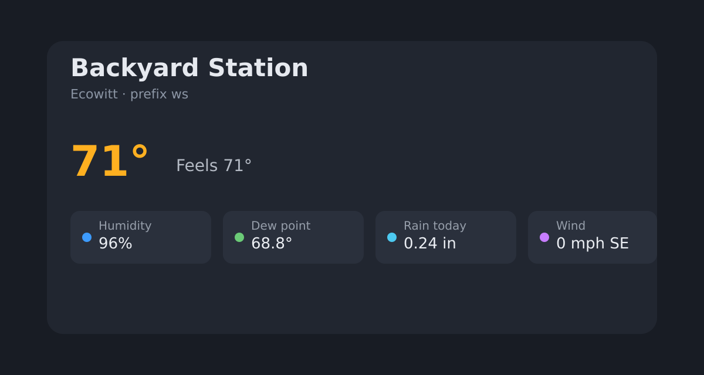

# Mushroom Weather Station Card

A Lovelace card for **personal weather station** sensors (Ecowitt, Ambient, Fine Offset, and similar). Prefix auto-fill, Home Assistant entity pickers, heat/UV coloring, wind compass, and rain sparkline.



[](https://www.home-assistant.io)
[](https://hacs.xyz)
[](https://github.com/highergroundstudio/lovelace-mushroom-weather-station-card/releases)
[](LICENSE)

[](https://my.home-assistant.io/redirect/hacs_repository/?owner=highergroundstudio&repository=lovelace-mushroom-weather-station-card&category=plugin)

## About

One `prefix` field maps Ecowitt-style entity IDs (`sensor.ws_temperature`, `sensor.ws_daily_rain`, …). Override any slot with a real Home Assistant entity picker. Mushroom itself is **not required**.

Confirm the install in the card editor banner: **Mushroom Weather Station Card · v0.4.2**.

## Install with HACS

1. HACS → **Custom repositories**
2. URL: `https://github.com/highergroundstudio/lovelace-mushroom-weather-station-card`
3. Type: **Dashboard**
4. Download **Mushroom Weather Station Card**
5. Hard-refresh the browser (Ctrl+F5)

```yaml
url: /hacsfiles/lovelace-mushroom-weather-station-card/mushroom-weather-station-card.js
type: module
```

Both of these files must be in the same folder after install:

- `mushroom-weather-station-card.js` — card
- `mushroom-weather-station-card-editor.js` — visual editor (loaded when you open Edit)

## Add the card

```yaml
type: custom:mushroom-weather-station-card
name: Backyard Station
prefix: ws
layout: full
unit_system: native
```

Layouts: `full`, `compact`, `chips`.

## Options

```yaml
unit_system: imperial   # or metric | native
tablet_mode: true
show_forecast: true
weather_entity: weather.home
battery_warning_threshold: 20
hide_sun: false
thresholds:
  uv:
    - above: 8
      color: purple
  temperature:
    - below: 32
      color: blue
labels:
  temperature: Outside
units:
  rain_today: in
```

Visual editor tabs: **Layout** · **Entities** · **Display**.

## Just to be clear

This project is **not affiliated with, endorsed, or supported by** the Home Assistant project or by the Mushroom Cards authors. It is provided as-is.

## Contributing

Bugs and ideas: use the GitHub issue templates (bug / feature). Pull requests against `main` are welcome.

## License

MIT — see [LICENSE](LICENSE).
